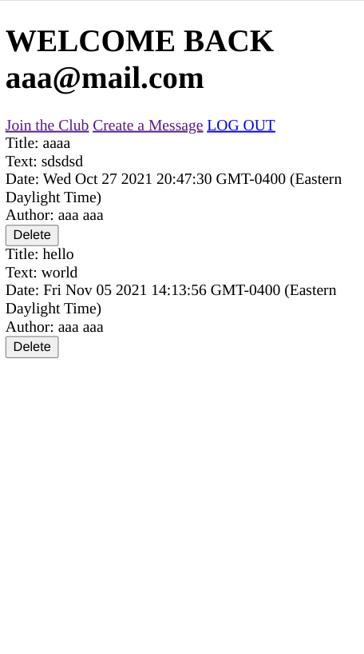

<h1 align="center">Members Only</h1>

   Solution for a challenge from  <a href="https://www.theodinproject.com/paths/full-stack-javascript/courses/nodejs/lessons/members-only" target="_blank">theodinproject.com</a>.

## Table of Contents

- [Overview](#overview)
  - [Built With](#built-with)
  - [Thoughts](#thoughts)
- [Features](#features)
- [Improvements](#improvements)
- [Useful Resources](#useful-resources)

## Overview

### Built With

- Express
- Bcrypt
- EJS
- Mongoose
- Passport

### Thoughts

Originally, tried to use subdocuments with Mongoose.  I found out that subdocuments are not recommended for performance reasons and thus documentation is severely lacking.

To run this yourself, git clone and add your own mongo connection string in 'app.js'. 

## Features

The [challenge](https://www.theodinproject.com/paths/full-stack-javascript/courses/nodejs/lessons/members-only) was to build an exclusive clubhouse where your members can write anonymous posts. Inside the clubhouse, members can see who the author of a post is, but outside they can only see the story and wonder who wrote it.

## Improvements

- Styling
- Confirm Password field
- Tests
- Error handling
- Field Structure i.e. Models & Routes folders
- Problems with the checkbox implementation
- Delete route not protected

### Resources

- [EJS](https://ejs.co/)
- [Stack Overflow](https://stackoverflow.com/questions/8737082/mongoose-schema-within-schema) - Mongoose subdocuments
- [Stack Overflow](https://stackoverflow.com/questions/18022365/mongoose-validate-email-syntax) - Mongoose validation
- [Stack Overflow](https://stackoverflow.com/questions/24493243/update-logged-in-user-details-in-session) - updated user in session
- [Stack Overflow](https://stackoverflow.com/questions/20521795/how-to-update-req-user-session-object-set-by-passportjs) - passport update user
- [Stack Overflow](https://stackoverflow.com/questions/23273123/list-all-values-of-a-certain-field-in-mongodb) - find()
- [Stack Overflow](https://stackoverflow.com/questions/14103615/mongoose-get-full-list-of-users) - find()
- [Stack Overflow](https://stackoverflow.com/questions/18913533/mongodb-find-returns-nothing) - find() no results
- [Stack Overflow](https://stackoverflow.com/questions/24985684/mongodb-show-all-contents-from-all-collections) - Hyphen named collection problems
- [Stack Overflow](https://stackoverflow.com/questions/37616719/pass-a-variable-from-javascript-to-ejs) - variables ejs
- [Stack Overflow](https://stackoverflow.com/questions/22952044/loop-through-json-in-ejs) - loop ejs
- [Stack Overflow](https://stackoverflow.com/questions/49121377/ejs-get-nested-object) - ejs nested object
- [Stack Overflow](https://stackoverflow.com/questions/5809788/how-do-i-remove-documents-using-node-js-mongoose) - remove documents
- [Stack Overflow](https://stackoverflow.com/questions/59193168/how-to-delete-an-nested-object-based-on-its-objectid) - nested object delete
- [Mongo](https://www.mongodb.com/community/forums/t/how-to-delete-a-specific-nested-subdocument-completely-from-an-document/100219/5) - delete subdocument
- [Make School](https://makeschool.org/mediabook/oa/tutorials/rotten-potatoes---movie-reviews-with-express-js/deleting-a-review/) - deleting
- [Stack Overflow](https://stackoverflow.com/questions/28194089/how-to-delete-a-subdoc-in-mongoose-nodejs-express) - delete a subdoc
- [Stack Overflow](https://stackoverflow.com/questions/17636379/deleting-a-subdocument-by-id-in-mongo-using-node-js) - delete a subdoc
- [Stack Overflow](https://stackoverflow.com/questions/66727607/mongoose-save-is-not-a-function-when-using-find-and-atributing-value-to-var) - save() issues
- [Stack Overflow](https://stackoverflow.com/questions/22278761/mongoose-difference-between-save-and-using-update) - how mongoose save() works
- [Stack Overflow](https://stackoverflow.com/questions/8303900/mongodb-mongoose-findmany-find-all-documents-with-ids-listed-in-array) - findmany
- [Stack Overflow](https://stackoverflow.com/questions/14504385/why-cant-you-modify-the-data-returned-by-a-mongoose-query-ex-findbyid) - modify mongoose query

- [Stack Overflow](https://stackoverflow.com/questions/18553946/remove-sub-document-from-mongo-with-mongoose) - remove subdoc
- [Blog](https://zellwk.com/blog/mongoose-subdocuments/) - Mongoose subdocuments
- [Github](https://github.com/john-azzaro/Study-Mongoose-Schemas) - Mongoose Schemas

- [Github](https://github.com/Automattic/mongoose/issues/5022) - FindByIdAndDelete()